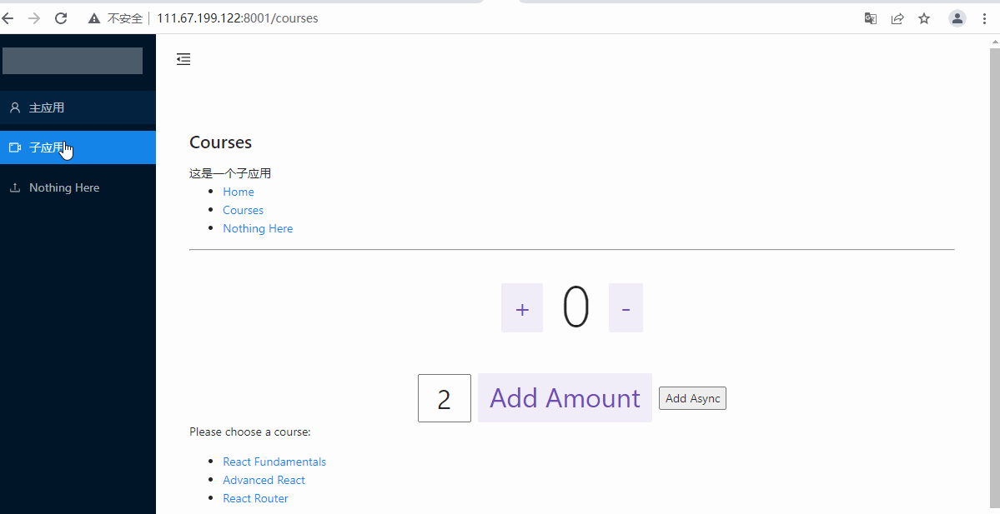

微前端配置注意点：    
1.主应用需要配置暴露子应用路由    
2.主应用需要配置子应用（部署的）域名地址     

3.子应用需要配置匹配主应用路由     
4.子应用部署服务器需要支持跨域（本地开发时，本地服务器需要配置支持跨域）    

若想本地运行：

cd到两个应用目录下面，都执行`npm i` 然后 `npm run start`

还需要将react-main/src/index 里面的entry配置修改为:
entry: '//localhost:3000'

